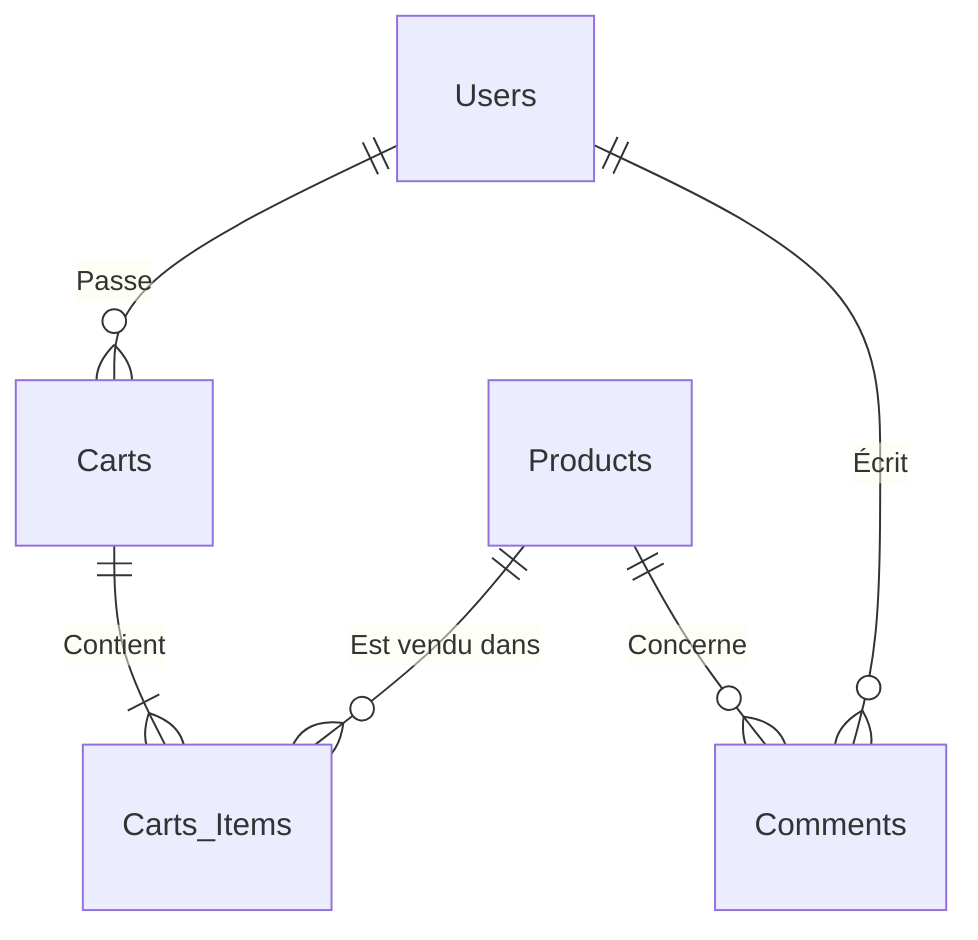

# Projet Power BI : QuickShop Live Dashboard

> **Contexte** : Vous venez d'intégrer l'équipe Data de *QuickShop*, une start-up E-commerce en pleine expansion. Votre mission est de moderniser le reporting en connectant Power BI directement aux données "Live" de l'entreprise via leur API.

> **Niveau** : Intermédiaire / Avancé

---

## Objectifs Pédagogiques
Ce projet valide 4 piliers de la BI moderne :
1.  **ETL Avancé** : Traitement de listes JSON imbriquées et typage rigoureux.
2.  **Time Intelligence** : Comparaison de périodes (N vs N-1) en DAX.
3.  **UX Design** : Navigation par signets, mise en page mobile et infobulles.
4.  **Professionnalisme** : Documentation et publication.

---

## Les Données (API Sources)
Vous utiliserez l'API publique de test **DummyJSON**. 
Voici les 4 sources de données à connecter dans Power BI (Connecteur Web) :

| Table Cible | URL de l'API | Description |
| :--- | :--- | :--- |
| **Produits** | `https://dummyjson.com/products?limit=100` | Catalogue, Prix, Stock, Catégorie, Images. |
| **Clients** | `https://dummyjson.com/users?limit=100` | Données CRM : Adresse, Âge, Genre. |
| **Commandes** | `https://dummyjson.com/carts?limit=50` | Transactions de vente. **Attention : Structure complexe à aplatir.** |
| **Avis Clients** | `https://dummyjson.com/comments?limit=100` | Sentiments et retours utilisateurs. Permet d'analyser la satisfaction. |

---

## Les Problèmes Business à Résoudre
Votre rapport ne doit pas juste "montrer des chiffres". Il doit répondre à ces 3 angoisses du CEO :

### Problème 1 : "Perd-on de l'argent sur les promos ?"
> *Le CEO pense que les produits trop remisés détruisent la marge.*
*   **La Solution Visuelle attendue** : Un **Nuage de points (Scatter Plot)** croisant le *% de Remise* (Axe X) et la *Marge Générée* (Axe Y).
*   **L'Insight** : Identifier si les produits à forte remise sont rentables ou non.

### Problème 2 : "Qui sont nos meilleurs clients ?"
> *Le Marketing veut cibler les clients VIP mais ne sait pas où ils sont.*
*   **La Solution Visuelle attendue** : Une **Carte interactiv (Map)** avec des bulles dont la taille dépend du *CA Client*.
*   **L'Insight** : Voir instantanément les zones géographiques à fort potentiel.

### Problème 3 : "La satisfaction client baisse-t-elle ?"
> *Le Service Client reçoit des plaintes mais n'a pas de vision globale.*
*   **La Solution Visuelle attendue** : Une analyse textuelle simple ou un indicateur de **Volume de Commentaires** par produit.
*   **L'Insight** : Repérer les produits qui génèrent le plus de réactions (souvent synonyme de problème si associé à de faibles ventes).

---

## Cahier des Charges Technique

### 1. Power Query & Transformation
*   Nettoyez les données brutes.
*   **Challenge Technique** : La table `carts` contient une liste imbriquée de produits. Vous devez "Développer" (Expand) cette colonne pour obtenir **une ligne par produit vendu**.
*   Gérez correctement les types de données (Devises, Dates, Coordonnées Géo).

### 2. Modélisation
*   Construisez un **Schéma en Étoile**.
*   Table de Faits : `Ventes` (détail des commandes).
*   Tables de Dimension : `Produits` et `Clients`.
*   Créez une table `Calendrier` (Date) pour l'analyse temporelle.

### 3. Mesures DAX
Ne créez pas de colonnes calculées, utilisez uniquement des **Mesures**.
*   `[CA Total]` : Chiffre d'Affaires global.
*   `[Nombre de Commandes]` : Volume de transactions.
*   `[Panier Moyen]` : CA moyen par commande.
*   `[Taux de Remise Moyen]` : Moyenne des réductions accordées.

### 4. Design & UX
Ne faites pas un simple "dashboard", créez une **Application Analytique**.
*   **Navigation** : Créez une **Page d'Accueil** avec des boutons de navigation pour aller vers les pages de détail.
*   **Vue Mobile** : Vous devez obligatoirement concevoir la vue "Téléphone" de votre rapport.
*   **Charte Graphique** : Importez un fond d'écran (Image) créé sur PowerPoint/Canva.
*   **Bonus "Wow"** : Affichez l'image du produit (URL API) dans une **Infobulle (Tooltip)** au survol.

### 5. Analyse Temporelle
*   Créez une mesure `[CA Année Précédente]` (Utilisez `SAMEPERIODLASTYEAR` ou `CALCULATE`).
*   Affichez la **Variation en %** par rapport à l'année précédente.
*   *Note : Comme les données sont fictives, si l'année en cours est vide, simulez une date de référence.*

---

## Guide de Rendu

### Méthode de Rendu
Vous devez rendre votre projet sous deux formes :

1.  **Le Code (GitHub)**
    *   Forkez ce dépôt.
    *   Ajoutez votre fichier `.pbix`.
    *   Ajoutez un fichier `RAPPORT.md` court expliquant :
        *   Vos choix de modélisation.
        *   Une difficulté technique rencontrée et comment vous l'avez contournée.
        *   Une capture d'écran de votre Dashboard.

2.  **La Présentation (Oral)**
    *   Durée : 10 minutes.
    *   Support : Démo live de votre rapport Power BI (Service ou Desktop).
    *   Scénario : Vous présentez vos découvertes au CEO de QuickShop.

### Schéma Relationnel Cible (Aide Mémoire)

---

## Comment Démarrer ?
1.  Ouvrez Power BI Desktop (Vierge).
2.  Cliquez sur `Obtenir les données` > `Web`.
3.  Collez l'URL des Produits pour commencer.
4.  À vous de jouer !

## Rendu
Déposez votre fichier `.pbix` final ici ou envoyez le lien de votre dépôt Git si vous versionnez votre travail.
Nom du fichier : `NOM_Prenom_QuickShop.pbix`
